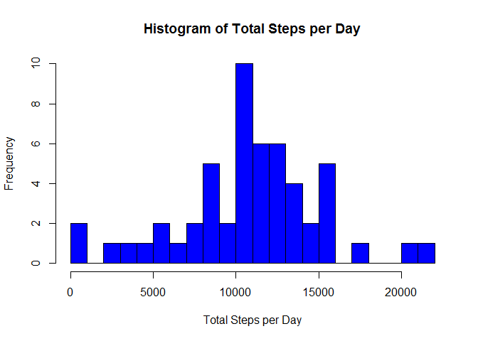
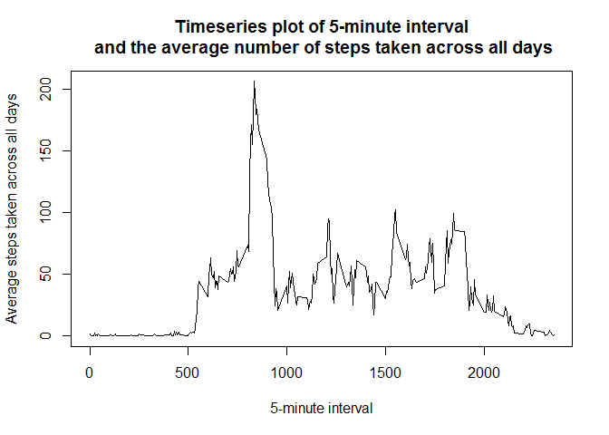
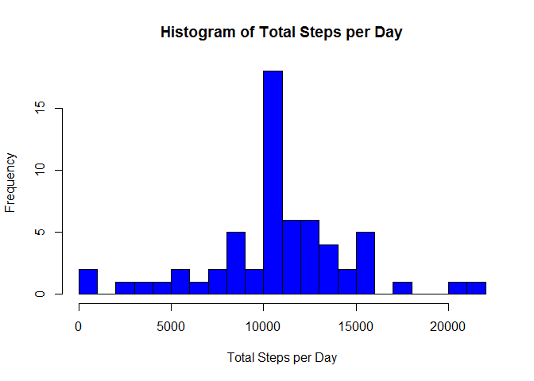
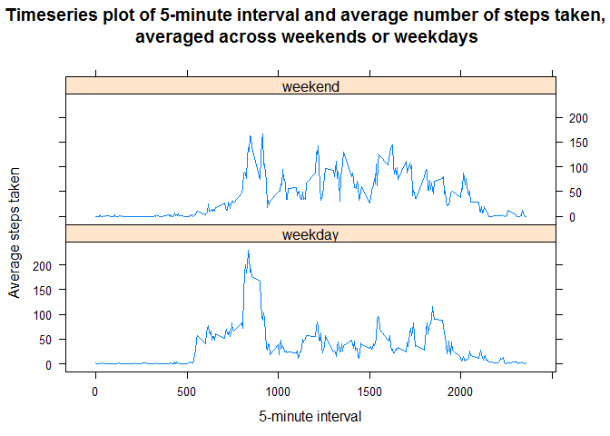

# Reproducible Research: Peer Assessment 1

## Introduction

It is now possible to collect a large amount of data about personal movement using activity monitoring devices such as a Fitbit, Nike Fuelband, or Jawbone Up. These type of devices are part of the "quantified self" movement - a group of enthusiasts who take measurements about themselves regularly to improve their health, to find patterns in their behavior, or because they are tech geeks. But these data remain under-utilized both because the raw data are hard to obtain and there is a lack of statistical methods and software for processing and interpreting the data.

This assignment makes use of data from a personal activity monitoring device. This device collects data at 5 minute intervals through out the day. The data consists of two months of data from an anonymous individual collected during the months of October and November, 2012 and include the number of steps taken in 5 minute intervals each day.

## Loading and preprocessing the data

Assume we have set the working directory to be where the data file is available, let us load the activity.zip file for processing.


```r
## load the file
activity.full<-read.csv(unz("activity.zip", "activity.csv"), header=TRUE)
str(activity.full)
```

```
## 'data.frame':	17568 obs. of  3 variables:
##  $ steps   : int  NA NA NA NA NA NA NA NA NA NA ...
##  $ date    : Factor w/ 61 levels "2012-10-01","2012-10-02",..: 1 1 1 1 1 1 1 1 1 1 ...
##  $ interval: int  0 5 10 15 20 25 30 35 40 45 ...
```

Now that we understand the data, let us do some preprocessing to transform the data to be suitable for subsequent analysis.

```r
## convert date attribute represented as a factor to be actual date representations
activity.full$date<-as.Date(activity.full$date)
## omit missing values in the dataset
activity<-na.omit(activity.full)
summary(activity)
```

```
##      steps             date               interval     
##  Min.   :  0.00   Min.   :2012-10-02   Min.   :   0.0  
##  1st Qu.:  0.00   1st Qu.:2012-10-16   1st Qu.: 588.8  
##  Median :  0.00   Median :2012-10-29   Median :1177.5  
##  Mean   : 37.38   Mean   :2012-10-30   Mean   :1177.5  
##  3rd Qu.: 12.00   3rd Qu.:2012-11-16   3rd Qu.:1766.2  
##  Max.   :806.00   Max.   :2012-11-29   Max.   :2355.0
```

## What is mean total number of steps taken per day?

Let us compute the total number of steps taken per day and contruct a histogram with breaks for better visual representation.


```r
library(plyr)
## compute total number of steps taken per day
daywisesteps<-ddply(activity, .(date), summarize, totsteps=sum(steps))
## construct histogram with breaks for better visual representation
hist(daywisesteps$totsteps, col="blue", main="Histogram of Total Steps per Day",
     xlab="Total Steps per Day", breaks=20)
```

 

We compute the mean as 10766 and median as 10765 of the total number of steps taken per day.

## What is the average daily activity pattern?

Let us make a timeseries plot of the 5-minute interval (x-axis) and the average number of steps taken, averaged across all days (y-axis).

```r
## average number of steps taken, averaged across all days 
intervalavg<-ddply(activity, .(interval), summarize, avgsteps=mean(steps))
## time series plot
plot(intervalavg$interval, intervalavg$avgsteps, type="l",
     main="Timeseries plot of 5-minute interval\n and the average number of steps taken across all days",
     xlab="5-minute interval",
     ylab="Average steps taken across all days")
```

 

Let us compute the 5-minute interval, on average across all the days in the dataset, that contains the maximum number of steps.

```r
intervalavg[intervalavg$avgsteps == max(intervalavg$avgsteps), ]
```

```
##     interval avgsteps
## 104      835 206.1698
```
## Imputing missing values

Let us compute the total number of missing values in the dataset and use a strategy of filling the missing values with the mean for that 5-minute interval that we had computed earlier. Confirm there are no missing values in the new dataset.


```r
activity.na<-is.na(activity.full)
## total number of missing values
sum(activity.na)
```

```
## [1] 2304
```

```r
## supply the missing values with the mean for that 5-minute interval computed earlier
activity.full[activity.na,]<-ddply(activity.full[activity.na,], 
                                   "date", 
                                   mutate, 
                                   steps=round(intervalavg[(intervalavg$interval== interval), c(2)]))
## confirm there are no missing values
sum(is.na(activity.full))
```

```
## [1] 0
```

Let us compute the total number of steps taken per day with the new dataset and contruct a histogram with breaks for better visual representation.


```r
## compute total number of steps taken per day
daywisesteps.full<-ddply(activity.full, .(date), summarize, totsteps=sum(steps))
## construct histogram with breaks for better visual representation
hist(daywisesteps.full$totsteps, col="blue", main="Histogram of Total Steps per Day",
     xlab="Total Steps per Day", breaks=20)
```

 

We compute the mean as 10766 and median as 10762 of the total number of steps taken per day with the new dataset.

## Are there differences in activity patterns between weekdays and weekends?

Let us create a new factor variable in the new dataset with two levels - "weekday" and "weekend" indicating whether a given date is a weekday or weekend day. Compute the average number of steps taken, averaged across all weekdays or weekends.

```r
## create new factor variable according to if the date is weekend or weekday
activity.full$daytype<-as.factor(ifelse((weekdays(as.Date(activity.full$date)) %in% c('Saturday','Sunday')),
                                        "weekend", 
                                        "weekday" ))
## compute average number of steps taken, across interval and daytype
intervalavg.full<-ddply(activity.full, c("interval", "daytype"), summarize, avgsteps=mean(steps))
## check the data
head(intervalavg.full,5)
```

```
##   interval daytype  avgsteps
## 1        0 weekday 2.2888889
## 2        0 weekend 0.2500000
## 3        5 weekday 0.4000000
## 4        5 weekend 0.0000000
## 5       10 weekday 0.1555556
```

Let us create a panel plot containing a time series plot (i.e. type = "l") of the 5-minute interval (x-axis) and the average number of steps taken, averaged across all weekday days or weekend days (y-axis).

```r
library(lattice)
xyplot( avgsteps ~ interval | daytype, 
        intervalavg.full, 
        type="l", 
        layout=c(1,2),
        main="Timeseries plot of 5-minute interval and average number of steps taken,\n averaged across weekends or weekdays",
        xlab="5-minute interval",
        ylab="Average steps taken")
```

 

We can observe the activity is more pronounced across a wider 5-minute interval range in the weekends compared to the weekdays.
